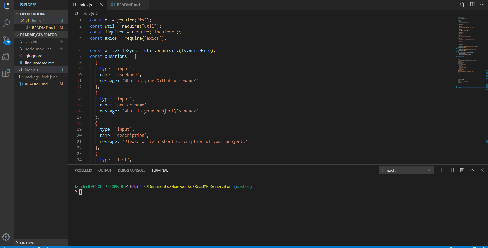

# Readme Generator
  ​
  ## Description
  ​This homework was learning how to create a readme file using an index.js file, axios, and inquirer prompts/answers from the user. When using this, a readme file should be created based on the answer given from the user.

  ## Preview
  
    ​
  ## Files
  * finalReadme.md
  * index.js
  * README.md
  * .gitignore
  * Assets
    * readmegif.gif

  ## Installation
  To use this code to create a readme file, you will need to install (npm i):
  * axios
  * inquirer
  * util
  ​
  ​
  ## Links
    https://github.com/kkwoka/ReadME_Generator